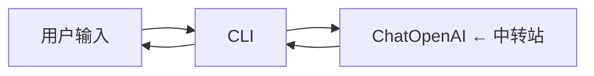

# Day 1 · 起步 & Hello Agent

> **📖 阅读对象**
> - 人类读者：按顺序读；代码看"关键代码骨架"，细节自己补。
> - AI 模型：把本文当 spec —— 按「3. 目标产物」创建/修改文件，按「6. 验收」自证交付。

---

## 0. 30 秒速览

- **上一天终点**：空仓库
- **今天终点**：拥有一个可运行的 Python 项目，跑 `uv run lustre hello` 能拿到 LLM 的一句回复
- **新增能力**：LLM 可调用；项目骨架就位

## 1. 你将学到的概念（Why）

- **Agent Loop 的四要素**：LLM（决策）+ Tool（动作）+ Memory（上下文）+ Control Flow（流程） — 这是后续六天的核心主线
- **为什么用 uv**：速度快、锁文件稳、`uv run` 免去 venv 激活心智负担
- **第三方 OpenAI 兼容中转站**：统一走 `base_url + api_key` 形式，`langchain-openai` 的 `ChatOpenAI` 开箱支持



本章只搭 **CLI → LLM** 这条最短链路；`Tool / Memory / Graph` 从 Day 2 开始加。

## 2. 前置条件

| 类别 | 要求 |
|---|---|
| 环境 | macOS / Linux / WSL；Python 3.11+；已安装 [uv](https://docs.astral.sh/uv/) |
| 账号 | 已有一个 OpenAI 兼容的第三方中转站账号（`OPENAI_API_BASE` + `OPENAI_API_KEY`） |
| 知识 | 会用 Python、基本 CLI；**不需要**预先懂 LangGraph |

## 3. 目标产物

```tree
Lustre-Agent/
├── pyproject.toml              ← 新增
├── uv.lock                     ← 新增（uv sync 自动生成）
├── .env.example                ← 已有
├── .env                        ← 你自己创建（gitignore 已排除）
├── src/lustre_agent/
│   ├── __init__.py             ← 新增
│   ├── cli.py                  ← 新增（Typer 入口）
│   ├── config.py               ← 新增（加载 .env）
│   └── llm.py                  ← 新增（ChatOpenAI 封装）
└── tests/
    └── day1_smoke.py           ← 新增
```

**依赖清单**（Day 1 需要）：

- `langchain-openai`
- `typer`
- `python-dotenv`
- `pytest`（dev）

## 4. 实现步骤

### Step 1 — `pyproject.toml` 与入口点

- 定义包名 `lustre-agent`、Python 3.11+、依赖、console script `lustre = "lustre_agent.cli:app"`
- 运行 `uv sync` 生成锁文件

### Step 2 — `config.py` 加载 `.env`

- 用 `python-dotenv` 加载；暴露 `Settings` 单例（pydantic-settings 也可）
- 必备字段：`openai_api_base`、`openai_api_key`、`model`

### Step 3 — `llm.py` 封装 LLM 客户端

- 一个函数 `get_llm(model: str | None = None) -> ChatOpenAI`
- 默认读 `Settings.model`；允许调用方覆盖（为后面 Planner/Coder/Reviewer 各自用不同模型铺路）

### Step 4 — `cli.py` 搭 Typer

- `lustre hello` 子命令：调 `llm.invoke("Say hi in one sentence")`，打印到 stdout
- 为后续命令（`/code`, `/history` 等）留好扩展点

### Step 5 — smoke test

- `tests/day1_smoke.py`：
  - 能 import `lustre_agent.cli`
  - `get_llm()` 返回的对象具备 `invoke` 方法
  - *（可选）*用 monkeypatch 注入 fake client，断言 `hello` 命令的行为

## 5. 关键代码骨架

```python
# src/lustre_agent/config.py
from pydantic_settings import BaseSettings

class Settings(BaseSettings):
    openai_api_base: str
    openai_api_key: str
    model: str = "claude-sonnet-4-5"

    class Config:
        env_file = ".env"
        env_prefix = ""

settings = Settings()
```

```python
# src/lustre_agent/llm.py
from langchain_openai import ChatOpenAI
from .config import settings

def get_llm(model: str | None = None) -> ChatOpenAI:
    ...
```

```python
# src/lustre_agent/cli.py
import typer
app = typer.Typer()

@app.command()
def hello():
    """最小 LLM 调用演示"""
    ...

if __name__ == "__main__":
    app()
```

## 6. 验收

### 6.1 手动

```bash
uv sync
cp .env.example .env   # 填入真实值
uv run lustre hello
# 预期：打印一句 LLM 回复
```

### 6.2 自动

```bash
uv run pytest tests/day1_smoke.py -v
```

检查项：

- [ ] `from lustre_agent.cli import app` 不报错
- [ ] `get_llm()` 返回对象具备 `.invoke` 方法
- [ ] `hello` 命令在 mock client 下能正常跑完

## 7. 常见坑 & FAQ

- **Q**: `uv run` 报找不到 `lustre`？
  **A**: 检查 `pyproject.toml` 里的 `[project.scripts]` 段是否写对；重新 `uv sync`。
- **Q**: 第三方中转站需要额外 header？
  **A**: `ChatOpenAI(default_headers={...})` 传入。
- **Q**: 想切回 Anthropic 原生 SDK？
  **A**: 后续章节用的是 LangChain 抽象，切换只需改 `get_llm` 内部实现。

## 8. 小结 & 下一步

- **今日核心**：搭好脚手架，验证 LLM 可调
- **你现在可以**：`uv run lustre hello`
- **明日（Day 2）预告**：引入 LangGraph，把"一次性调用"升级为"多轮对话 + 记忆 + 历史回放"

---

<details>
<summary>📎 AI 执行者的额外规则</summary>

1. 只创建「3. 目标产物」列出的文件。
2. 不要提前引入 `langgraph`，那是 Day 2 的事。
3. 交付完成须通过「6. 验收」的自动检查。

</details>
