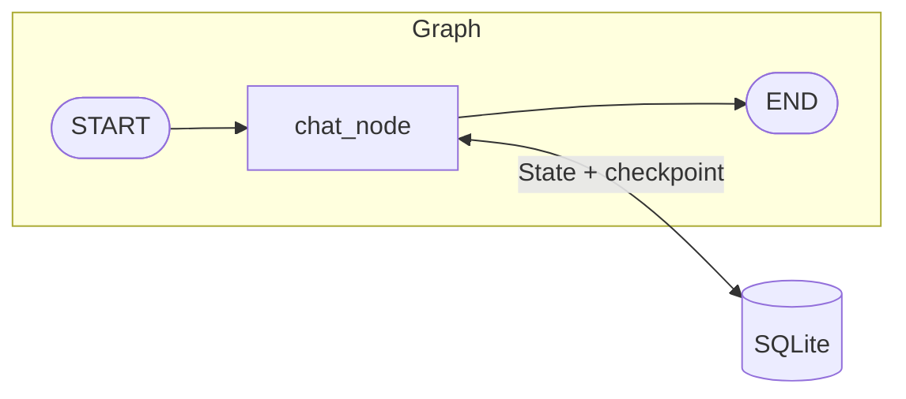

# Day 2 · LangGraph 地基

## 0. 30 秒速览

- **上一天终点**：`lustre hello` 跑通单次 LLM 调用
- **今天终点**：`lustre`（无参数）进入聊天模式；多轮对话自动记得上文；`lustre replay <id>` 可回放
- **新增能力**：LangGraph 核心 API 上手；短期记忆与会话持久化

## 1. 概念（Why）

- **`StateGraph`**：图状工作流的建模单位。节点是函数，边是流转规则，`State` 在节点间流动
- **State**：全图共享的数据结构（TypedDict / pydantic）。Message 列表用 `add_messages` reducer 做追加合并
- **Checkpointer（`MemorySaver`/`SqliteSaver`）**：每次节点跑完自动保存 State 快照
- **`thread_id`**：会话隔离键；同一个 `thread_id` 的多次调用会从 checkpoint 继续



## 2. 前置条件

- 已完成 Day 1
- 新增依赖：`langgraph`、`langgraph-checkpoint-sqlite`、`langchain-core`、`rich`（CLI 美化）、`prompt_toolkit`（输入行）
- 知识假设：了解 Python TypedDict、基础装饰器

## 3. 目标产物

```
src/lustre_agent/
├── graph.py              ← 新增：State 定义 + 图组装
├── memory.py             ← 新增：checkpointer 工厂 + thread 列表
├── agents/
│   ├── __init__.py       ← 新增（空包）
│   └── chat.py           ← 新增：默认聊天 agent 节点
├── cli.py                ← 修改：默认进入 chat REPL；新增 replay 子命令
tests/
├── day2_smoke.py         ← 新增
```

CLI 行为约定：

| 输入 | 行为 |
|---|---|
| `uv run lustre`（无子命令） | 进入聊天 REPL（默认 agent） |
| REPL 内 `/history` | 列出所有历史 thread_id |
| REPL 内 `/replay <id>` | 打印指定 thread 的完整消息 |
| REPL 内 `/new` | 开新会话（生成新 thread_id） |
| REPL 内 `/exit` | 退出 |
| `uv run lustre replay <id>` | 在 REPL 外回放指定会话 |

> **注意**：`/code` 入口是 Day 4 的事，本日先不实现。

## 4. 实现步骤

### Step 1 — 定义 State（`graph.py`）

`add_messages` 是 reducer：每次节点返回新消息时，它把消息**追加**到列表而非覆盖。

```python
from typing import Annotated, TypedDict
from langgraph.graph.message import add_messages

class State(TypedDict):
    messages: Annotated[list, add_messages]
```

后续章节会向 `State` 追加字段（`plan` / `tasks` / `review_result` 等），本章只有 `messages`。

### Step 2 — `memory.py`：checkpointer 工厂

- 用 `sqlite3.connect(..., check_same_thread=False)` 创建连接，手动传给 `SqliteSaver`——这样可在 REPL 整个生命周期内复用同一连接，不用 context manager
- `LUSTRE_DATA_DIR` 由环境变量控制，默认 `.lustre/`
- `list_thread_ids()` 直接查 SQLite `checkpoints` 表的 `thread_id` 列；表不存在时静默返回空列表
- **不暴露** `get_thread_messages()`——消息读取交给 `graph.get_state(config)` 来做，避免手动反序列化 checkpoint blob

### Step 3 — `agents/chat.py`：聊天节点

节点做成工厂函数 `make_chat_node(llm=None)`，这样测试时可以注入假 LLM，不发真实 API 请求：

```python
def make_chat_node(llm=None):
    def chat_node(state) -> dict:
        _llm = llm or get_llm()
        system = SystemMessage(content="你是 Lustre-Agent 的默认聊天助手。...")
        response = _llm.invoke([system] + list(state["messages"]))
        return {"messages": [response]}
    return chat_node
```

state 参数用 duck typing（不直接 import `State`），避免循环导入。

### Step 4 — `graph.py`：组装图

`build_graph` 同样接受可选 `llm` / `checkpointer` 参数，方便测试时传入内存 checkpointer：

```python
def build_graph(llm=None, checkpointer=None):
    if checkpointer is None:
        checkpointer = make_checkpointer()
    g = StateGraph(State)
    g.add_node("chat", make_chat_node(llm))
    g.add_edge(START, "chat")
    g.add_edge("chat", END)
    return g.compile(checkpointer=checkpointer)
```

### Step 5 — `cli.py` REPL 逻辑

用 `@app.callback(invoke_without_command=True)` 实现"无子命令时进入 REPL"，同时保留 `hello`/`version`/`replay` 等具名子命令：

```python
@app.callback(invoke_without_command=True)
def default(ctx: typer.Context):
    if ctx.invoked_subcommand is None:
        _chat_repl()
```

REPL 每轮：
1. `prompt_toolkit.prompt()` 读输入（支持方向键历史）
2. `/` 前缀 → 路由到 `/history` / `/replay <id>` / `/new` / `/exit`
3. 否则 → `graph.invoke({"messages": [HumanMessage(...)]}, config={"configurable": {"thread_id": ...}})`
4. 用 `rich.Markdown` 渲染 AI 回复

`/replay <id>` 和 `lustre replay <id>` 都通过 `graph.get_state(config).values["messages"]` 读取消息，无需额外序列化逻辑。

### Step 6 — smoke test

测试策略：`MemorySaver`（纯内存）+ `_EchoLLM`（假 LLM），完全离线，无 API 调用：

```python
class _EchoLLM:
    def invoke(self, messages):
        return AIMessage(content="echo")

@pytest.fixture
def graph():
    return build_graph(llm=_EchoLLM(), checkpointer=MemorySaver())
```

## 5. 实际代码

### `src/lustre_agent/graph.py`

```python
from typing import Annotated, TypedDict

from langgraph.graph import END, START, StateGraph
from langgraph.graph.message import add_messages

from .agents.chat import make_chat_node
from .memory import make_checkpointer


class State(TypedDict):
    messages: Annotated[list, add_messages]


def build_graph(llm=None, checkpointer=None):
    if checkpointer is None:
        checkpointer = make_checkpointer()
    g = StateGraph(State)
    g.add_node("chat", make_chat_node(llm))
    g.add_edge(START, "chat")
    g.add_edge("chat", END)
    return g.compile(checkpointer=checkpointer)
```

### `src/lustre_agent/memory.py`

```python
import sqlite3
from pathlib import Path
import os

LUSTRE_DATA_DIR = Path(os.getenv("LUSTRE_DATA_DIR", ".lustre"))


def _db_path() -> Path:
    LUSTRE_DATA_DIR.mkdir(parents=True, exist_ok=True)
    return LUSTRE_DATA_DIR / "checkpoints.sqlite"


def make_checkpointer():
    from langgraph.checkpoint.sqlite import SqliteSaver
    conn = sqlite3.connect(str(_db_path()), check_same_thread=False)
    return SqliteSaver(conn)


def list_thread_ids() -> list[str]:
    db = _db_path()
    if not db.exists():
        return []
    try:
        conn = sqlite3.connect(str(db), check_same_thread=False)
        try:
            cur = conn.execute(
                "SELECT DISTINCT thread_id FROM checkpoints ORDER BY thread_id"
            )
            return [row[0] for row in cur.fetchall()]
        except sqlite3.OperationalError:
            return []  # 表还不存在
        finally:
            conn.close()
    except Exception:
        return []
```

### `src/lustre_agent/agents/chat.py`

```python
from langchain_core.messages import SystemMessage
from ..llm import get_llm

SYSTEM_PROMPT = "你是 Lustre-Agent 的默认聊天助手。请用中文或用户所用语言回复。"


def make_chat_node(llm=None):
    def chat_node(state) -> dict:
        _llm = llm or get_llm()
        system = SystemMessage(content=SYSTEM_PROMPT)
        response = _llm.invoke([system] + list(state["messages"]))
        return {"messages": [response]}
    return chat_node
```

### `tests/day2_smoke.py`

```python
import pytest
from langchain_core.messages import AIMessage, HumanMessage
from langgraph.checkpoint.memory import MemorySaver


class _EchoLLM:
    def invoke(self, messages):
        return AIMessage(content="echo")


@pytest.fixture
def graph():
    from lustre_agent.graph import build_graph
    return build_graph(llm=_EchoLLM(), checkpointer=MemorySaver())


def test_graph_compiles(graph):
    assert graph is not None


def test_same_thread_accumulates_messages(graph):
    cfg = {"configurable": {"thread_id": "t-same"}}
    graph.invoke({"messages": [HumanMessage(content="first")]}, config=cfg)
    result = graph.invoke({"messages": [HumanMessage(content="second")]}, config=cfg)
    assert len(result["messages"]) == 4  # human, ai, human, ai


def test_different_threads_are_isolated(graph):
    cfg_a = {"configurable": {"thread_id": "t-a"}}
    cfg_b = {"configurable": {"thread_id": "t-b"}}
    graph.invoke({"messages": [HumanMessage(content="hello")]}, config=cfg_a)
    result_b = graph.invoke({"messages": [HumanMessage(content="world")]}, config=cfg_b)
    assert len(result_b["messages"]) == 2
```

## 6. 验收

### 6.1 手动

```bash
uv run lustre
# 进入 REPL，输入 "我叫 Eva"
# 再输入 "我叫什么？"，预期模型答出 Eva
# /history 看到当前会话 id（当前会话标 ← current）
# /exit
uv run lustre replay <上面的 id>   # 打印完整对话
```

### 6.2 自动

```bash
uv run pytest tests/ -v
```

检查项：

- [x] `build_graph()` 能 compile
- [x] 同 thread 两轮对话后 messages 长度 == 4
- [x] 不同 thread 状态隔离

## 7. 遇到的坑 & 决策

| 坑 | 解法 |
|---|---|
| `SqliteSaver` 不能多线程访问 | `sqlite3.connect(..., check_same_thread=False)` |
| `add_messages` 会去重同 id 消息 | 测试时用 `HumanMessage(content=...)` 让 LangChain 自动生成 UUID，不手写 id |
| `agents/chat.py` 导入 `State` 会循环导入 | chat node 的 state 参数用 duck typing，不 import `State` 类型 |
| `pytest tests/` 收集到 0 个测试 | `*_smoke.py` 不符合默认 `test_*.py` 模式；在 `pyproject.toml` 加 `python_files = ["test_*.py", "*_test.py", "*_smoke.py"]` |
| `graph.get_state()` 读消息比手动解 checkpoint blob 更干净 | `/replay` 直接调 `graph.get_state(config).values["messages"]`，memory.py 不再暴露 `get_thread_messages()` |

## 8. 小结 & 下一步

- **今日核心**：用最小图 + SQLite checkpointer 完成"能记事"的聊天 agent
- **你现在可以**：作为 ChatGPT-lite 本地用，历史会话持久化到 `.lustre/checkpoints.sqlite`
- **明日（Day 3）预告**：加 tool，让 agent 开始"动手"
