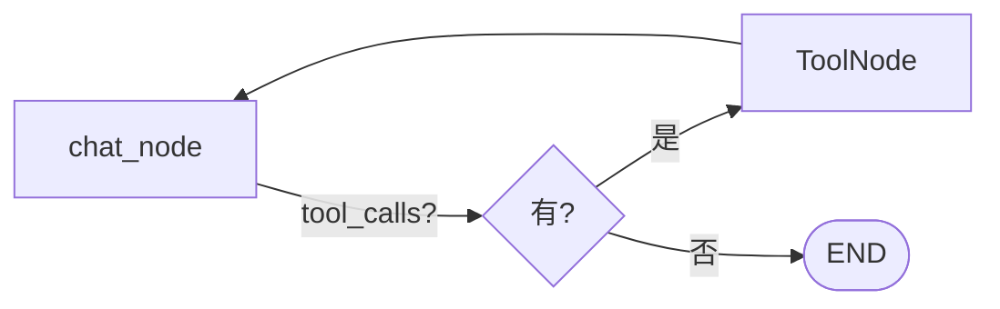

# Day 3 · Tool Use

## 0. 30 秒速览

- **上一天终点**：能聊天、能记事
- **今天终点**：Agent 能调用 `read_file` / `write_file` / `list_dir` / `run_shell` 四个工具；工具调用走白名单沙箱
- **新增能力**：让 agent 从"嘴强"变"会干活"

## 1. 概念（Why）

- **Tool Calling**：LLM 输出结构化的 "我想调用工具 X，参数 Y"；runtime 执行后把结果塞回消息流
- **`ToolNode`**：LangGraph 内置节点，按最近 AIMessage 里的 tool_calls 批量执行
- **MCP-friendly schema**：我们用 `@tool` 装饰器定义工具时，参数用 pydantic → 转 JSON schema；与 MCP 工具描述等价，为 Appendix B 铺路
- **沙箱**：`run_shell` 必须白名单命令 + 超时 + 禁网（本章先做白名单 + 超时）



## 2. 前置条件

- 已完成 Day 2
- 新增依赖：`pydantic`、`langchain-core` 的 `@tool`
- 知识假设：了解 JSON Schema、LLM 的 tool-use 原理

## 3. 目标产物

```tree
src/lustre_agent/
├── tools/
│   ├── __init__.py       ← 新增（register_all / 汇总）
│   ├── fs.py             ← 新增（read_file / write_file / list_dir）
│   └── shell.py          ← 新增（run_shell 带白名单）
├── agents/
│   └── chat.py           ← 修改：绑定 tools，切换到 bind_tools
├── graph.py              ← 修改：加 ToolNode + conditional edge
tests/
├── day3_smoke.py         ← 新增
```

## 4. 实现步骤

### Step 1 — 定义工具

- 每个 tool 用 `@tool` 装饰器 + pydantic 参数模型
- 工具以"纯函数 + 无副作用包装"为原则，便于测试

### Step 2 — 沙箱 `run_shell`

- 默认白名单：`python`, `pytest`, `uv`, `ls`, `cat`, `pwd`, `grep`, `find`
- `subprocess.run(..., timeout=30, cwd=<project root>)`
- 命令不在白名单则返回 error，不抛异常（保持 agent 可感知失败）

### Step 3 — 绑定到 agent

- `llm_with_tools = get_llm().bind_tools(ALL_TOOLS)`
- `chat_node` 调用 `llm_with_tools` 取代 `get_llm()`

### Step 4 — 图里加 ToolNode + 条件边

- `g.add_node("tools", ToolNode(ALL_TOOLS))`
- `g.add_conditional_edges("chat", tools_condition, {"tools": "tools", END: END})`
- `g.add_edge("tools", "chat")`（执行完回到 agent 再判断）

### Step 5 — smoke test

- 给 agent 一个要求写文件的 prompt，断言文件被创建
- 给 agent 一个 `run_shell` 请求执行非白名单命令，断言返回含 "denied"

## 5. 关键代码骨架

```python
# src/lustre_agent/tools/fs.py
from langchain_core.tools import tool
from pydantic import BaseModel, Field

class ReadFileArgs(BaseModel):
    path: str = Field(..., description="相对项目根的路径")

@tool("read_file", args_schema=ReadFileArgs)
def read_file(path: str) -> str:
    """读取文件内容"""
    ...
```

```python
# src/lustre_agent/tools/shell.py
import subprocess, shlex

WHITELIST = {"python", "pytest", "uv", "ls", "cat", "pwd", "grep", "find"}

@tool("run_shell")
def run_shell(cmd: str) -> dict:
    """在项目根目录执行白名单命令，返回 {returncode, stdout, stderr}"""
    ...
```

## 6. 验收

### 6.1 手动

```bash
uv run lustre
> 帮我在 playground/hello.txt 写一句 "hi from lustre"
# agent 应该调用 write_file 并确认
> cat playground/hello.txt 的内容
# agent 应该 read_file 并复述
```

### 6.2 自动

```bash
uv run pytest tests/day3_smoke.py -v
```

检查项：

- [ ] 所有 tool 可独立调用且参数 schema 正确
- [ ] `run_shell("rm -rf /")` 返回 denied、不执行
- [ ] Graph 里走 chat → tools → chat 循环，最终正常 END

## 7. 常见坑

- `ToolNode` 依赖 AIMessage 上的 `tool_calls` 字段，要确保模型支持
- Windows 下 `subprocess` shell 差异，本教程假设 POSIX 环境（WSL 也可）
- 小心"工具调用失败把错误回传给 agent，agent 又乱改"——返回 dict 比抛异常更友好

## 8. 小结 & 下一步

- **今日核心**：工具抽象 + 条件边循环；让 agent 真正能干活
- **你现在可以**：让聊天 agent 做本地小任务
- **明日（Day 4）预告**：加 Planner，把 `/code <需求>` 变成结构化任务计划

---

## 9. 实际实现记录

### 9.1 文件结构

```
src/lustre_agent/
├── tools/
│   ├── __init__.py       新增：汇总 ALL_TOOLS 列表
│   ├── fs.py             新增：read_file / write_file / list_dir
│   └── shell.py          新增：run_shell 带白名单
├── agents/
│   └── chat.py           修改：make_chat_node 内改用 llm.bind_tools(ALL_TOOLS)
├── graph.py              修改：加 ToolNode 节点 + tools_condition 条件边
tests/
└── day3_smoke.py         新增：10 个测试（单元 + graph 集成）
```

### 9.2 关键实现细节

**`tools/fs.py` — 路径安全**

用 `Path.resolve()` 验证路径不越界到项目根目录之外：

```python
_PROJECT_ROOT = Path(__file__).resolve().parents[4]

def _resolve(path: str) -> Path:
    resolved = (_PROJECT_ROOT / path).resolve()
    if not str(resolved).startswith(str(_PROJECT_ROOT)):
        raise ValueError(f"Path {path!r} escapes project root")
    return resolved
```

三个工具都经过 `_resolve()` 检查，`write_file` 额外调用 `mkdir(parents=True, exist_ok=True)` 自动创建父目录。

**`tools/shell.py` — 白名单沙箱**

用 `shlex.split` 解析命令，取 `parts[0]` 与白名单对比，不在白名单直接返回 dict 而不抛异常，让 agent 能感知并处理失败：

```python
WHITELIST = {"python", "pytest", "uv", "ls", "cat", "pwd", "grep", "find"}

if executable not in WHITELIST:
    return {"returncode": -1, "stdout": "", "stderr": f"denied: '{executable}' is not in the allowed command whitelist"}
```

**`agents/chat.py` — bind_tools**

`make_chat_node` 改为每次调用时执行 `bind_tools`，保持 llm 可替换（测试时注入 fake LLM）：

```python
def chat_node(state) -> dict:
    _llm = llm or get_llm()
    llm_with_tools = _llm.bind_tools(ALL_TOOLS)
    response = llm_with_tools.invoke([system] + list(state["messages"]))
    return {"messages": [response]}
```

**`graph.py` — 条件循环**

用 LangGraph 内置的 `tools_condition` 判断最新 AIMessage 是否含 `tool_calls`：

```python
from langgraph.prebuilt import ToolNode, tools_condition

g.add_node("tools", ToolNode(ALL_TOOLS))
g.add_conditional_edges("chat", tools_condition, {"tools": "tools", END: END})
g.add_edge("tools", "chat")
```

形成 `chat → (有 tool_calls?) → tools → chat → ... → END` 的循环。

### 9.3 测试策略

smoke test 里的 fake LLM 通过 `_call_count` 控制行为：
- 第 1 次 `invoke` 返回带 `tool_calls` 的 AIMessage（触发工具执行）
- 第 2 次 `invoke` 返回普通文本（结束循环）

fake LLM 实现了 `bind_tools(self)` 返回 `self`，保证注入路径与真实 LLM 一致。

### 9.4 验收结果

```
tests/day3_smoke.py::test_write_and_read_file               PASSED
tests/day3_smoke.py::test_read_missing_file                 PASSED
tests/day3_smoke.py::test_list_dir                          PASSED
tests/day3_smoke.py::test_run_shell_whitelist_denied        PASSED
tests/day3_smoke.py::test_run_shell_whitelist_allowed       PASSED
tests/day3_smoke.py::test_run_shell_dangerous_commands_denied PASSED
tests/day3_smoke.py::test_all_tools_registered              PASSED
tests/day3_smoke.py::test_tool_schemas_valid                PASSED
tests/day3_smoke.py::test_graph_calls_write_file_tool       PASSED
tests/day3_smoke.py::test_graph_denies_non_whitelisted_shell PASSED

10 passed in 0.38s
```
