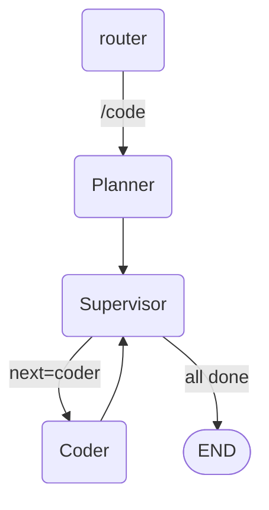

# Day 5 · Coder + Supervisor

## 0. 30 秒速览

- **上一天终点**：Planner 能输出 TaskPlan
- **今天终点**：Supervisor 依 DAG 调度 Coder 逐个任务执行；Coder 把代码落盘；`/code` 走完 Planner → Coder 两棒
- **新增能力**：Supervisor 拓扑、subgraph 组合、agent 间 handoff

## 1. 概念（Why）

- **Supervisor 拓扑**：一个路由型节点决定"下一步交给哪个 agent"；对应 LangGraph 的 conditional edge
- **Subgraph**：把多 agent 协作图当作子图编译，外层 router 只管"进入/离开"子图
- **Handoff**：agent 之间传递的不是自由文本，而是 State 字段（我们已有的 `plan` + 新增 `current_task_id`、`artifacts`）
- **Agent 执行策略**：Coder 使用 **ReAct 风格**（LLM ↔ Tool 循环），`create_react_agent` 是 LangGraph 内置快捷方式



## 2. 前置条件

- 已完成 Day 4
- 新增依赖：`langgraph.prebuilt`（`create_react_agent`）
- 知识：ReAct 思维；拓扑排序

## 3. 目标产物

```tree
src/lustre_agent/
├── agents/
│   ├── supervisor.py         ← 新增：decide_next_task / 调度
│   └── coder.py              ← 新增：ReAct agent（带 fs/shell tools）
├── prompts/
│   └── coder.md              ← 新增
├── schemas.py                ← 扩展：TaskResult / ArtifactsMap
├── graph.py                  ← 修改：子图组装
tests/
├── day5_smoke.py             ← 新增
```

State 新增字段：

- `current_task_id: str | None`
- `artifacts: dict[task_id, str]`（任务产物简报，文件列表 + 摘要）
- `task_status: dict[task_id, "pending"|"done"|"failed"]`

## 4. 实现步骤

### Step 1 — Supervisor

- 每次被调度时：
  1. 检查 `task_status`，找到所有 deps 已 done 的 pending 任务
  2. 选下一个（拓扑序里第一个）或 all_done → END
  3. 写 `current_task_id` 回 State

### Step 2 — Coder

- `create_react_agent(llm, tools=[read_file, write_file, list_dir, run_shell], prompt=CODER_PROMPT)`
- prompt 里告诉它：当前任务是 `state.current_task_id` → `Task` 对象 + 任务目标；做完后写一段简报（由 supervisor 解析到 artifacts）

### Step 3 — 图组装

- Planner → Supervisor
- Supervisor 根据"是否还有 pending 任务"条件边到 Coder 或 END
- Coder 完成后回到 Supervisor（循环）

### Step 4 — 取消"继续执行"交互

- Day 4 留的 "Y/n" 默认改成 Y；加 `--dry-run` flag 保留"只规划不执行"

### Step 5 — 限速与预算

- `max_iterations=20` 给 Coder 的 ReAct 循环上界
- Supervisor 检测同一个任务连续失败 3 次 → 标 failed，继续下一个（Day 6 Reviewer 会重写这段）

### Step 6 — smoke test

- 给一个"写一个 add 函数在 playground/add.py 并能被 import 使用"的需求
- 断言：`playground/add.py` 被创建、包含 `def add(`、`task_status` 全 done

## 5. 关键代码骨架

```python
# src/lustre_agent/agents/supervisor.py
def decide_next(state):
    done = {t for t, s in state["task_status"].items() if s == "done"}
    for task in topological_order(state["plan"].tasks):
        if task.id in done: continue
        if set(task.deps).issubset(done):
            return {"current_task_id": task.id}
    return {"current_task_id": None}  # all done
```

```python
# src/lustre_agent/agents/coder.py
from langgraph.prebuilt import create_react_agent
from ..llm import get_llm
from ..tools import ALL_TOOLS

coder_executor = create_react_agent(
    get_llm(),
    tools=ALL_TOOLS,
    prompt=CODER_PROMPT,
)

def coder_node(state):
    task = ...  # 从 state 里拿当前 task
    result = coder_executor.invoke({"messages": [...]})
    # 解析 artifacts，更新 task_status
    ...
```

## 6. 验收

### 6.1 手动

```bash
uv run lustre
> /code 写一个 add(a,b) 函数放在 playground/add.py 并写 pytest
# 预期：Planner 出计划 → Supervisor/Coder 创建文件 → 最终打印 "all tasks done"
ls playground/         # 应看到 add.py 和测试
```

### 6.2 自动

```bash
uv run pytest tests/day5_smoke.py -v
```

检查项：

- [ ] Planner → Supervisor → Coder 完整走一遍，无死循环
- [ ] DAG 中 deps 在 dep 完成后才被选中
- [ ] 至少一个任务的 artifacts 含创建的文件路径

## 7. 常见坑

- Coder 开始乱改整个仓库：prompt 里强约束"只在当前任务描述的范围内改动"
- Supervisor 判定"all done"的条件：所有任务都 done OR failed（避免失败任务把调度卡死）
- `create_react_agent` 默认的 prompt 会覆盖你的 system；要传 `prompt=` 参数或自己组 messages

## 8. 小结 & 下一步

- **今日核心**：Supervisor 拓扑 + Coder ReAct agent
- **你现在可以**：让 agent 按计划真的写代码
- **明日（Day 6）预告**：Reviewer 加入，跑测试、不过打回 Coder；三 agent 完整闭环
