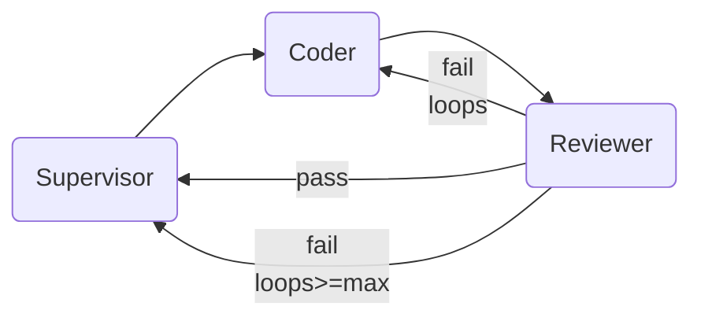

# Day 6 · Reviewer + 闭环

## 0. 30 秒速览

- **上一天终点**：Planner → Coder 两棒跑通，代码能落盘
- **今天终点**：Reviewer 对每个任务产物做代码审查 + 跑测试；不通过则把反馈回传 Coder 让其修复；三 agent 完整闭环跑通 FastAPI demo
- **新增能力**：Conditional edge、循环控制、失败回归、预算约束

## 1. 概念（Why）

- **Reviewer 的职责**：静态检查（有没有乱改无关文件、是否符合 acceptance）+ 动态检查（`pytest` 是否通过）
- **闭环**：Coder → Reviewer → [pass] 下一任务 / [fail] 回 Coder 修
- **最大重试**：同任务失败超过 `LUSTRE_MAX_REVIEW_LOOPS`（默认 3）后标 failed 并继续（避免死循环烧钱）
- **回归提示**：Reviewer 的 feedback 需以"具体文件 + 具体问题 + 建议改法"形式，喂给 Coder 新一轮



## 2. 前置条件

- 已完成 Day 5
- 新增依赖：`pytest`（已在 dev；Reviewer 需要在子进程调用）
- 知识：subprocess 超时、LangGraph `Command` / conditional edge

## 3. 目标产物

```tree
src/lustre_agent/
├── agents/
│   └── reviewer.py           ← 新增
├── prompts/
│   └── reviewer.md           ← 新增
├── tools/
│   └── pytest_runner.py      ← 新增（独立于 run_shell，返回结构化结果）
├── schemas.py                ← 扩展：ReviewResult
├── graph.py                  ← 修改：Coder → Reviewer 边；重试循环
tests/
├── day6_smoke.py             ← 新增
├── acceptance_fastapi.py     ← 新增：Day 7 也会用到的验收脚本的雏形
```

State 新增字段：

- `review: ReviewResult | None`
- `review_loops: dict[task_id, int]`

## 4. 实现步骤

### Step 1 — `ReviewResult` schema

```python
class ReviewResult(BaseModel):
    passed: bool
    summary: str
    issues: list[str]
    suggested_fixes: list[str]
    pytest_output: str | None
```

### Step 2 — `pytest_runner` 工具

- `run_pytest(path, timeout=60) -> dict{returncode, stdout, stderr}`
- 不走 LLM；是个普通 Python 工具

### Step 3 — Reviewer agent

- 读取：当前任务、Coder 的 artifacts、改动的文件内容、pytest 输出
- 结构化输出 `ReviewResult`
- Prompt 重点：只评判、不修改、不越界

### Step 4 — 图连线

- Coder → Reviewer（直连）
- Reviewer 条件边：
  - `passed == True` → 更新 `task_status[current] = done` → 回 Supervisor
  - `passed == False` 且 `review_loops < max` → 回 Coder（把 feedback 加入 messages）
  - 失败超上限 → `task_status[current] = failed` → 回 Supervisor

### Step 5 — Coder 接收 feedback

- 当 State 中有上一轮 `review` 且非 pass：prompt 模板里拼进 feedback，让 Coder 针对性修

### Step 6 — 端到端 FastAPI demo

- `examples/fastapi-todo/` 放一个期望输出的"参考答案"供对照
- `tests/acceptance_fastapi.py`：跑 `/code "make a FastAPI todo API with tests"`，断言生成文件包含 `app.py`、`pytest` 通过

### Step 7 — smoke test

- 构造一个假的 ReviewResult 注入 State，断言图走 Coder 的重试分支
- 走通 `review_loops` 上限后进入 failed 分支

## 5. 关键代码骨架

```python
# src/lustre_agent/agents/reviewer.py
def reviewer_node(state):
    task = ...
    pytest_out = run_pytest(...)
    llm = get_llm().with_structured_output(ReviewResult)
    result = llm.invoke([...])  # 带 pytest_out、diff、task.acceptance
    loops = state["review_loops"].get(task.id, 0) + 1
    return {"review": result, "review_loops": {**state["review_loops"], task.id: loops}}
```

```python
# src/lustre_agent/graph.py（片段）
g.add_node("reviewer", reviewer_node)
g.add_edge("coder", "reviewer")
g.add_conditional_edges("reviewer", review_decide, {
    "supervisor_done": "supervisor",
    "retry": "coder",
    "supervisor_failed": "supervisor",
})
```

## 6. 验收

### 6.1 手动（**这是整个项目的里程碑！**）

```bash
uv run lustre
> /code 做一个 FastAPI todo API 支持 GET/POST，用 pytest 测一个 happy path，放到 examples/fastapi-todo/
```

预期：

- Planner 出 4–6 个任务的 DAG
- Coder 逐任务写代码；过程可见 Reviewer 的反馈（甚至看到一次打回修复）
- 最终 `uv run pytest examples/fastapi-todo/` 全绿
- 终端打印 "🎉 all tasks done"

### 6.2 自动

```bash
uv run pytest tests/day6_smoke.py tests/acceptance_fastapi.py -v
```

检查项：

- [ ] 失败任务能触发至少一次 Coder 重试
- [ ] 达到 `max_loops` 会终止循环
- [ ] acceptance 脚本端到端通过（可以 mock 掉 LLM 用离线产物）

## 7. 常见坑

- **死循环**：务必用 review_loops 计数；不要仅依赖模型自报"我要重试"
- **上下文爆炸**：Coder 多轮累积消息太长；每次 Coder 被召回时只保留最近一次 feedback + 当前任务描述
- **Reviewer 过于宽松/严苛**：prompt 里给出 acceptance，Reviewer 只对照 acceptance 判断
- **pytest 在子进程跑**：环境变量、cwd 要设好；超时必须兜底

## 8. 小结 & 下一步

- **今日核心**：闭环 = 条件边 + 循环上界 + 结构化反馈
- **你现在可以**：跑出一个可观测的"需求→计划→实现→测试→修复"端到端流程
- **明日（Day 7）预告**：打磨（trace、成本、CI、README），开源发布
