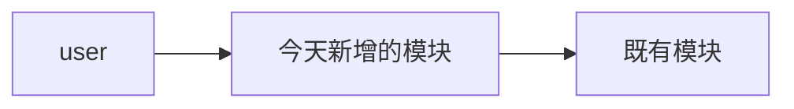

# Day N · <主题>

> **📖 阅读对象**
> - 人类读者：按顺序读；代码看"关键代码骨架"，细节自己补。
> - AI 模型：把本文当 spec —— 按「3. 目标产物」创建/修改文件，按「6. 验收」自证交付。骨架以外的逻辑由你补全；如遇冲突以「3. 目标产物」为准。

---

## 0. 30 秒速览

- **上一天终点**：（一句话描述 Day N-1 的产出）
- **今天终点**：（一句话描述本章做完后的状态）
- **新增能力**：（点明本章解锁的 1–3 个能力）

## 1. 你将学到的概念（Why）

> 用"人话 + 类比"讲清楚每个概念，再点明它在整体架构中的位置。

- **概念 A**：一句话定义 + 一个类比
- **概念 B**：...
- **本章在架构中的位置**：（文字或图，标出本章改动了哪一层）



## 2. 前置条件（Prerequisites）

| 类别 | 要求 |
|---|---|
| 仓库状态 | 已完成 Day N-1，建议打 tag `day(N-1)-end` |
| 环境 | Python 3.11+、uv、`.env` 已配好 `OPENAI_API_BASE` / `OPENAI_API_KEY` |
| 依赖 | 新增包：`package-a`、`package-b`（用 `uv add` 安装） |
| 知识 | 读者/AI 已理解：概念 X、概念 Y |

## 3. 目标产物（Deliverables）

本章结束后，仓库目录应变成：

```tree
src/lustre_agent/
├── (新增/修改的文件)
tests/
├── dayN_smoke.py   ← 新增
```

**关键新增/修改文件清单**（AI 按此检查交付）：

- `src/lustre_agent/xxx.py` — 职责：<一句话>
- `src/lustre_agent/yyy.py` — 职责：<一句话>
- `tests/dayN_smoke.py` — smoke test

## 4. 实现步骤（How）

> 每个 Step 描述「做什么 + 改哪个文件 + 接口签名」。代码留给骨架与 AI。

### Step 1 — <目的>

- **要改**：`path/to/file.py`
- **要点**：（一句话说明这一步为什么存在）
- **接口签名**：
  ```python
  def thing(...) -> ReturnType:
      """简要 docstring"""
  ```

### Step 2 — <目的>

- ...

### Step 3 — <目的>

- ...

## 5. 关键代码骨架

> 只贴"结构性"代码（类名、函数签名、Graph 组装、State 形状）。业务逻辑由读者 / AI 补全。

```python
# src/lustre_agent/xxx.py

from typing import TypedDict
from langgraph.graph import StateGraph

class State(TypedDict):
    # ←—— State 形状，本章新增字段标注出来
    ...

def node_foo(state: State) -> dict:
    """节点 foo 的职责：..."""
    ...

def build_graph() -> StateGraph:
    g = StateGraph(State)
    # g.add_node(...)
    # g.add_edge(...)
    return g.compile()
```

## 6. 验收（Smoke Test）

### 6.1 手动验收

```bash
uv run lustre <命令>
# 预期输出包含：...
```

### 6.2 自动验收

```bash
uv run pytest tests/dayN_smoke.py -v
```

`tests/dayN_smoke.py` 至少检查：

- [ ] 检查项 1（例：`build_graph()` 能成功编译）
- [ ] 检查项 2（例：对一条 mock 输入返回期望字段）
- [ ] 检查项 3

## 7. 常见坑 & FAQ

- **Q**: ...
  **A**: ...
- **Q**: ...
  **A**: ...

## 8. 小结 & 下一步

- **今日核心**：一句话总结
- **你现在可以**：列出本章解锁的用户可见能力
- **明日预告**（Day N+1）：下一章会加什么

---

<details>
<summary>📎 AI 执行者的额外规则（点击展开）</summary>

1. 严格以「3. 目标产物」的文件清单为准生成文件；不要擅自新增未列出的文件。
2. 「5. 关键代码骨架」给出的签名 / State 形状不得更改，只能在函数体内补全逻辑。
3. 生成完后必须能通过「6. 验收」的自动检查，否则视为未完成。
4. 如果遇到模糊点，按"最小改动 + 保持向前兼容"原则处理，并在代码顶部 docstring 注明假设。

</details>
